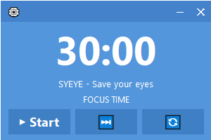

# SYEYE - Protect Your Eyes 👁️‍🗨️
### احمِ عينيك أثناء العمل على الكمبيوتر

**SYEYE** is a lightweight, always-on-top desktop application for Windows designed to protect your eyes during long computer usage. It uses a smart timer cycle (30 minutes focus / 7 minutes break) inspired by the Pomodoro technique to ensure you take regular breaks.

**SYEYE** هو تطبيق سطح مكتب خفيف الوزن لنظام Windows يبقى دائماً في مقدمة النوافذ، مصمم خصيصاً لحماية عينيك أثناء فترات العمل الطويلة على الكمبيوتر. يعتمد التطبيق على مؤقت ذكي (30 دقيقة تركيز / 7 دقائق راحة) لضمان أخذ فترات راحة منتظمة.

---

## ✨ Features / المميزات

### 🇬🇧 English
*   **Always on Top:** The timer window stays visible over all other applications so you never miss a break.
*   **Smart Timer Cycles:** Automatically alternates between 30 minutes of Focus Time and 7 minutes of Break Time.
*   **Interactive Alerts:** Plays a digital alert sound when focus time ends. The sound stops and the break starts immediately upon any mouse movement or keyboard press.
*   **Wait for Input:** After a break ends, the app waits for your interaction (mouse/keyboard) before starting the next focus session, ensuring you are ready.
*   **Minimalist & Draggable UI:** A clean, frameless interface that you can drag anywhere on your screen.
*   **Easy Controls:** 
    *   `▶` Start/Pause the timer.
    *   `⏭` Skip to the next phase (Break or Focus).
    *   `🔄` Reset the timer to the initial state.
*   **Customizable Settings (⚙):** Change focus/break duration, alert sound file, volume, and window opacity.
*   **System Tray Support:** Minimizes to the system tray (next to the clock) instead of closing completely.
*   **Global Hotkey:** Press `Ctrl + Alt + P` to Pause/Resume the timer from anywhere in Windows.
*   **Lightweight:** Built with Python & PyQt6, consuming minimal CPU and RAM.

### 🇪🇬 عربي
*   **دائماً في المقدمة (Always On Top):** يبقى التطبيق ظاهراً فوق جميع النوافذ الأخرى لضمان عدم نسيان وقت الراحة.
*   **دورات مؤقت ذكية:** يتبادل تلقائياً بين 30 دقيقة "وقت تركيز" و 7 دقائق "وقت راحة".
*   **تنبيهات تفاعلية:** يشغل صوت تنبيه عند انتهاء وقت التركيز. يتوقف الصوت ويبدأ وقت الراحة فوراً بمجرد تحريك الماوس أو الضغط على أي زر في الكيبورد.
*   **الانتظار للتفاعل:** بعد انتهاء وقت الراحة، ينتظر التطبيق تفاعلك مع الكمبيوتر قبل بدء جلسة التركيز التالية، مما يضمن أنك جاهز للعودة للعمل.
*   **واجهة بسيطة وقابلة للسحب:** تصميم أنيق وبدون حواف يمكن سحبه ووضعه في أي مكان على الشاشة.
*   **أزرار تحكم سهلة:**
    *   `▶` تشغيل / إيقاف مؤقت.
    *   `⏭` تخطي والانتقال للمرحلة التالية (راحة أو تركيز).
    *   `🔄` إعادة ضبط المؤقت لحالته الأولية.
*   **إعدادات قابلة للتخصيص (⚙):** يمكنك تغيير مدة التركيز والراحة، ملف صوت التنبيه، مستوى الصوت، وشفافية النافذة.
*   **شريط المهام (System Tray):** عند الضغط على زر التصغير (─)، يختفي البرنامج بجانب الساعة ولا يغلق تماماً.
*   **اختصار لوحة المفاتيح:** اضغط `Ctrl + Alt + P` لإيقاف أو استئناف المؤقت من أي مكان في الويندوز.
*   **خفيف جداً:** مبني بلغة Python ومكتبة PyQt6، ولا يستهلك موارد الجهاز (CPU/RAM).

---

## 🖥️ Interface Preview / شكل البرنامج




---

## 🚀 Installation & Usage / التثبيت والتشغيل

### Prerequisites / المتطلبات
*   Python 3.11 or higher.

### Steps / الخطوات
1.  **Clone the repository / انسخ المشروع:**
    ```bash
    git clone https://github.com/Ahmedusama77/SYEYE.git
    cd SYEYE
    ```

2.  **Install dependencies / تثبيت المكتبات:**
    ```bash
    pip install -r requirements.txt
    ```

3.  **Run the application / تشغيل التطبيق:**
    ```bash
    python main.py
    ```

> **Note for Windows Users:** Because the app uses global keyboard/mouse listeners (`pynput`) to detect your interaction, you might need to run the app as **Administrator** for it to detect inputs when other elevated windows (like Task Manager) are in focus.
> **ملاحظة لمستخدمي ويندوز:** نظراً لأن التطبيق يستخدم مستمعات عالمية للكيبورد والماوس، قد تحتاج إلى تشغيله كمسؤول (**Run as Administrator**) لضمان عمله بشكل صحيح عند وجود نوافذ أخرى تعمل بصلاحيات المسؤول.

---

## 📂 Project Structure / هيكل المشروع
```text
SYEYE/
│── main.py              # Entry point / نقطة بدء التشغيل
│── timer_engine.py      # Timer logic / منطق المؤقت
│── ui.py                # User Interface / واجهة المستخدم
│── input_listener.py    # Mouse/Keyboard detection / اكتشاف التفاعل
│── sound_manager.py     # Audio handling / تشغيل الصوت
│── tray.py              # System Tray logic / شريط المهام
│── settings_dialog.py   # Settings window / نافذة الإعدادات
│── config.json          # User settings storage / حفظ الإعدادات
│── requirements.txt     # Python dependencies / المكتبات المطلوبة
└── assets/
    │── icon.png         # App icon / أيقونة التطبيق
    └── alert.wav        # Alert sound / صوت التنبيه
